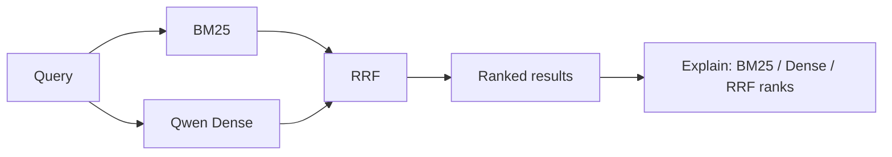

# Local RAG Search

**Local-first hybrid retrieval for RAG applications — BM25 + Qwen embeddings + reciprocal rank fusion, with rank provenance you can inspect.**

The project is intentionally retrieval-first: no chatbot wrapper is required to see whether search actually works.

## Demo

Run the pre-indexed portfolio demo:

```bash
uv sync
uv run uvicorn local_rag.api:demo_app --reload
```

Open **http://127.0.0.1:8000** and search the bundled corpus. The browser UI shows the result snippet together with **BM25 rank, Dense rank, and final RRF rank**, so the hybrid behavior is visible instead of hidden behind an answer model.

```text
query
  ├─→ BM25 ─────┐
  └─→ Qwen Dense ├─→ RRF ─→ ranked results + provenance
                 ┘
```

## Key result

Frozen evaluation on **64 official Confluence-compatible queries** from EnterpriseRAG-Bench v1.0.0 over **5,189 documents**:

| Retrieval arm | Recall@10 | MRR@20 | Hit@10 |
|---|---:|---:|---:|
| BM25 | 0.7341 | 0.6792 | 0.7969 |
| Qwen Dense | 0.6797 | 0.6919 | 0.7656 |
| **BM25 + Dense RRF** | **0.7630** | **0.7418** | **0.8438** |

RRF recovered **5 BM25 top-10 misses** while losing 2 BM25 top-10 hits in this slice. The result supports keeping hybrid retrieval here, not a claim that hybrid search is universally better.

Source of truth: [`runs/enterprise-rag-qwen-core-v1/report.json`](runs/enterprise-rag-qwen-core-v1/report.json).

## Architecture



Exact identifiers, error codes, and names often benefit from lexical search; paraphrases and conceptual matches benefit from dense retrieval. RRF merges the rankings without pretending BM25 and vector-similarity scores share the same scale.

## What the system exposes

- BM25 lexical retrieval and local Qwen dense retrieval.
- Reciprocal rank fusion with per-result rank provenance.
- Stable document IDs and collection context.
- Persistent embedding cache.
- Optional typed query fields: `lex`, `vec`, `hyde`, `intent`.
- One shared `SearchService` behind the browser demo, CLI, and FastAPI.
- Optional bounded reranking for experimentation; it is not part of the frozen three-arm comparison.

The repository is **inspired by QMD's local retrieval and typed-query ideas**, but it is not a QMD clone; the implementation and evaluation here are intentionally narrower.

## Quickstart

CLI:

```bash
uv run rag-search --corpus demo_docs query "why were buyers unable to finish a purchase?" --explain
```

API + browser demo:

```bash
uv run uvicorn local_rag.api:demo_app --reload
```

With local Qwen embeddings through Ollama:

```bash
ollama pull qwen3-embedding:0.6b
uv run rag-search --embedding ollama --corpus demo_docs query "payment failure"
```

Windows users can run `run-demo.cmd` or `run-api.cmd`.

## Examples

Exact identifier:

```bash
rag-search search "ORA-12516"
```

Vector-only query:

```bash
rag-search vsearch "why were buyers unable to finish a purchase?"
```

Typed hybrid query:

```bash
rag-search query "payment incident" \
  --lex "payment authorization" \
  --vec "users could not finish checkout" \
  --hyde "Payment checkout failed because authorization was rejected" \
  --explain
```

Explain mode shows BM25 rank, Dense rank, RRF rank, optional reranker score, matched typed signals, and collection context.

## Evaluation

The resume-facing run compares exactly three retrieval arms on the same frozen 64-query Confluence slice: **BM25**, real `qwen3-embedding:0.6b` **Dense**, and **BM25 + Dense RRF**. It is a reproducible retrieval slice, **not the full EnterpriseRAG-Bench leaderboard benchmark**.

The repository also ships a **6-query deterministic demo evaluation** for local product checks. It is a product sanity check, not research evidence:

| Demo mode | Recall@10 | MRR@20 |
|---|---:|---:|
| BM25 lexical | 83.3% | 70.0% |
| Demo dense | 100.0% | 70.8% |
| Hybrid RRF | **100.0%** | **77.4%** |

Evaluation queries and gold document IDs are physically separated; runtime search code never receives gold IDs.

## Design decisions

- **Retrieval stands on its own.** No generation model is required to inspect search quality.
- **RRF instead of raw-score mixing.** BM25 and vector scores are not treated as directly comparable.
- **Persistent dense cache.** Repeated local runs do not rebuild unchanged embeddings.
- **Thin interfaces.** Browser demo, CLI, and FastAPI all wrap the same `SearchService`.
- **Visible provenance.** The demo exposes where a result came from instead of presenting hybrid search as a black box.

More detail: [`docs/architecture.md`](docs/architecture.md), [`docs/design-decisions.md`](docs/design-decisions.md), and [`docs/qmd-inspiration.md`](docs/qmd-inspiration.md).

## Limitations

- The 64-query evaluation is Confluence-only and should not be generalized to every RAG workload.
- Dense retrieval uses a local model and carries embedding/index cost that BM25 avoids.
- The browser demo uses the bundled small corpus; it demonstrates the product path rather than the benchmark dataset.
- Retrieval metrics measure ranking quality, not end-to-end generated-answer quality.

## Development

```bash
python -m pytest -q
python -m compileall -q src evaluation tests
```
