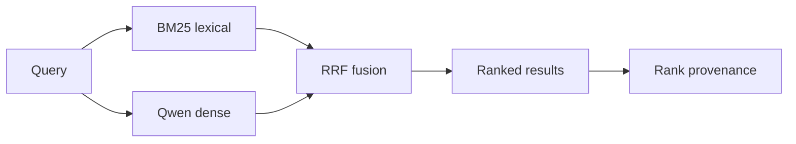

<h1 align="center">Local RAG Search</h1>

<p align="center">
  <strong>Local-first hybrid retrieval for RAG: BM25 + Qwen embeddings + reciprocal rank fusion, with ranking provenance you can inspect.</strong>
</p>

<p align="center">
  
  
  
  
  
</p>

<p align="center">
  <a href="#key-result">Key result</a> ·
  <a href="#architecture">Architecture</a> ·
  <a href="#quickstart">Quickstart</a> ·
  <a href="#evaluation">Evaluation</a>
</p>

## At a glance

| | |
|---|---|
| **Problem** | Lexical search catches exact terms; dense search catches semantic paraphrases. Either one alone can miss useful documents. |
| **What I built** | A local hybrid retriever that runs BM25 and Qwen dense retrieval, fuses them with RRF, and exposes the rank contribution of each signal. |
| **Evidence** | On a frozen 64-query Confluence slice over 5,189 documents, hybrid RRF reached **0.7630 Recall@10**, **0.7418 MRR@20**, and **0.8438 Hit@10**. |
| **Design focus** | Retrieval quality that is measurable and explainable — not hidden behind a chatbot. |

> [!NOTE]
> Every result can show its **BM25 rank, Dense rank, and final RRF rank**, so it is possible to inspect why fusion helped or hurt.

## Key result

Frozen evaluation on **64 official Confluence-compatible queries** from EnterpriseRAG-Bench v1.0.0 over **5,189 documents**:

| Retrieval arm | Recall@10 | MRR@20 | Hit@10 |
|---|---:|---:|---:|
| BM25 | 0.7341 | 0.6792 | 0.7969 |
| Qwen Dense | 0.6797 | 0.6919 | 0.7656 |
| **BM25 + Dense RRF** | **0.7630** | **0.7418** | **0.8438** |

In this frozen slice, RRF recovered **5 BM25 top-10 misses** while losing 2 BM25 top-10 hits. That supports hybrid retrieval here; it is not a claim that fusion is universally better.

Source of truth: [`runs/enterprise-rag-qwen-core-v1/report.json`](runs/enterprise-rag-qwen-core-v1/report.json).

## Architecture



```text
query
  ├─→ BM25 ─────┐
  └─→ Qwen Dense ├─→ RRF ─→ ranked results
                 ┘             ├─ BM25 rank
                               ├─ Dense rank
                               └─ final RRF rank
```

The repository keeps one shared `SearchService` behind the browser demo, CLI, and FastAPI surface.

## What the system exposes

- **Lexical vs semantic retrieval** — compare BM25 and local Qwen dense behavior on the same query.
- **Fusion provenance** — inspect BM25 rank, Dense rank, and final RRF rank per result.
- **Stable document identity** — keep document IDs and collection context visible through the pipeline.
- **Embedding cache** — avoid recomputing unchanged local embeddings.
- **Typed query signals** — optionally provide `lex`, `vec`, `hyde`, and `intent` fields.
- **One service boundary** — browser demo, CLI, and FastAPI all use the same retrieval implementation.

### Why this project

A RAG system can look good in a chat UI while the retriever underneath is weak or impossible to debug. This project isolates retrieval as its own engineering problem: compare lexical and dense search, fuse rankings without mixing incompatible raw scores, measure the result on a frozen query set, and expose enough provenance to explain individual ranking changes.

The repository is **inspired by QMD's local retrieval and typed-query ideas**, but it is **not a QMD clone**; the implementation and evaluation are intentionally narrower.

## Quickstart

```bash
uv sync
uv run uvicorn local_rag.api:demo_app --reload
```

Open **http://127.0.0.1:8000** and search the bundled corpus.

> [!NOTE]
> The bundled browser demo uses the deterministic lightweight `simple` embedding provider so it starts without Ollama. The measured benchmark path uses `qwen3-embedding:0.6b`; demo output should not be mistaken for the Qwen benchmark treatment.

Or from the CLI:

```bash
uv run rag-search --corpus demo_docs query "why were buyers unable to finish a purchase?" --explain
```

For local Qwen embeddings:

```bash
ollama pull qwen3-embedding:0.6b
uv run rag-search --embedding ollama --corpus demo_docs query "payment failure"
```

Windows users can run `run-demo.cmd` or `run-api.cmd`.

## Examples

Typed hybrid query with explain mode:

```bash
rag-search query "payment incident" \
  --lex "payment authorization" \
  --vec "users could not finish checkout" \
  --hyde "Payment checkout failed because authorization was rejected" \
  --explain
```

Explain mode shows BM25 rank, Dense rank, final RRF rank, optional reranker score, typed signals, and collection context. The FastAPI routes expose those provenance fields only when `explain: true`; retrieval itself always computes the same rankings.

## Evaluation

> [!IMPORTANT]
> The resume-facing run is a **64-query Confluence slice**, **not the full EnterpriseRAG-Bench leaderboard benchmark**. Retrieval metrics measure ranking quality, not generated-answer quality.

The repository also includes a **6-query deterministic demo evaluation** for local product checks:

| Demo mode | Recall@10 | MRR@20 |
|---|---:|---:|
| BM25 lexical | 83.3% | 70.0% |
| Demo dense | 100.0% | 70.8% |
| Hybrid RRF | **100.0%** | **77.4%** |

That 6-query run is a **product sanity check**, **not research evidence**. Evaluation queries and gold document IDs stay outside runtime search inputs.

## Design decisions

- **BM25 + dense retrieval** so exact identifiers and semantic paraphrases can both surface.
- **RRF instead of raw-score mixing** because BM25 and vector scores are not directly comparable.
- **Visible provenance** so retrieval decisions can be inspected rather than treated as a black box.
- **Persistent embedding cache** for repeatable local runs without rebuilding unchanged vectors.
- **Thin interfaces** around one `SearchService` instead of separate retrieval implementations per UI.

## Limitations

- The frozen evaluation is Confluence-only.
- Dense retrieval adds embedding/index cost that BM25 avoids.
- The browser demo uses a small bundled corpus and lightweight embedding fixture rather than the benchmark dataset/model path.
- Retrieval quality does not imply end-to-end answer quality.

More detail: [`docs/architecture.md`](docs/architecture.md) · [`docs/design-decisions.md`](docs/design-decisions.md) · [`docs/qmd-inspiration.md`](docs/qmd-inspiration.md)
