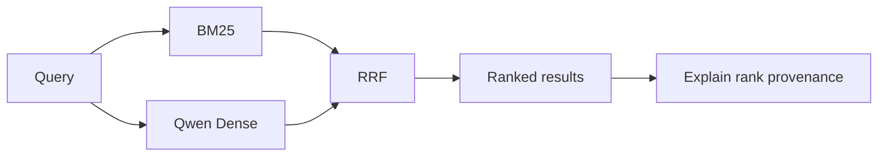

<h1 align="center">Local RAG Search</h1>

<p align="center">
  <strong>Local-first hybrid retrieval for RAG — BM25 + Qwen embeddings + reciprocal rank fusion, with ranking provenance you can inspect.</strong>
</p>

<p align="center">
  
  
  
  
  
</p>

> [!NOTE]
> This project keeps retrieval visible. You can inspect **why a result ranked where it did** without hiding the search behavior behind a chatbot.

## Demo

```bash
uv sync
uv run uvicorn local_rag.api:demo_app --reload
```

Open **http://127.0.0.1:8000** and search the bundled corpus.

```text
query
  ├─→ BM25 ─────┐
  └─→ Qwen Dense ├─→ RRF ─→ ranked results
                 ┘             + BM25 rank
                               + Dense rank
                               + final RRF rank
```

The browser demo shows the result snippet together with the lexical, dense, and fused rank provenance.

## Measured result

Frozen evaluation on **64 official Confluence-compatible queries** from EnterpriseRAG-Bench v1.0.0 over **5,189 documents**:

| Retrieval arm | Recall@10 | MRR@20 | Hit@10 |
|---|---:|---:|---:|
| BM25 | 0.7341 | 0.6792 | 0.7969 |
| Qwen Dense | 0.6797 | 0.6919 | 0.7656 |
| **BM25 + Dense RRF** | **0.7630** | **0.7418** | **0.8438** |

In this frozen slice, RRF recovered **5 BM25 top-10 misses** while losing 2 BM25 top-10 hits. That supports hybrid retrieval here; it is not a claim that fusion is universally better.

Source of truth: [`runs/enterprise-rag-qwen-core-v1/report.json`](runs/enterprise-rag-qwen-core-v1/report.json).

## Architecture



## Engineering choices

- **BM25 + dense retrieval** so exact identifiers and semantic paraphrases can both surface.
- **RRF instead of raw-score mixing** because BM25 and vector scores are not directly comparable.
- **Visible provenance** so the demo exposes where each result came from.
- **Persistent embedding cache** for repeatable local runs without rebuilding unchanged vectors.
- **One `SearchService`** behind browser demo, CLI, and FastAPI.
- **Evaluation separated from runtime inputs**; gold IDs never enter search execution.

## Quickstart

### Browser demo

```bash
uv run uvicorn local_rag.api:demo_app --reload
```

### CLI

```bash
uv run rag-search --corpus demo_docs query "why were buyers unable to finish a purchase?" --explain
```

### Local Qwen embeddings

```bash
ollama pull qwen3-embedding:0.6b
uv run rag-search --embedding ollama --corpus demo_docs query "payment failure"
```

Windows users can run `run-demo.cmd` or `run-api.cmd`.

## Explain mode

A hybrid query can expose the signals used for ranking:

```bash
rag-search query "payment incident" \
  --lex "payment authorization" \
  --vec "users could not finish checkout" \
  --hyde "Payment checkout failed because authorization was rejected" \
  --explain
```

Explain mode shows BM25 rank, Dense rank, final RRF rank, optional reranker score, typed signals, and collection context.

## Evaluation note

> [!IMPORTANT]
> The resume-facing run is a **64-query Confluence slice**, not the full EnterpriseRAG-Bench leaderboard benchmark. Retrieval metrics measure ranking quality, not generated-answer quality.

The repository also includes a small deterministic 6-query demo evaluation for local sanity checks; it is product validation, not research evidence.

## Limits

- The frozen evaluation is Confluence-only.
- Dense retrieval adds embedding/index cost that BM25 avoids.
- The browser demo uses a small bundled corpus rather than the benchmark dataset.
- Retrieval quality does not imply end-to-end answer quality.

More detail: [`docs/architecture.md`](docs/architecture.md) · [`docs/design-decisions.md`](docs/design-decisions.md) · [`docs/qmd-inspiration.md`](docs/qmd-inspiration.md)
